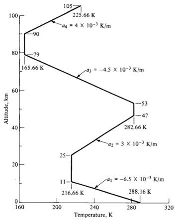

# High Altitude Balloon (HAB) Senior Capstone Project

## WORK IN PROGRESS

## Contents
1. [Project Importance](#user-content-project-importance)
2. [Every Parts List](#user-content-every-parts-list)
3. [Payload Construction](#user-content-payload-construction)
4. [Payload Arduino Code](#user-content-payload-arduino-code)
5. [Tracking Receiver Construction](#user-content-tracking-receiver-construction)
6. [Tracking Receiver Code](#user-content-tracking-receiver-code)
7. [Launch Protocol](#user-content-launch-protocol)
8. [Data Results](#user-content-data-results)
9. [Photo Results](#user-content-photo-results)
10. [Useful Online Tools](#user-content-useful-online-tools)
11. [Resources and Inspirations](#user-content-resources-and-inspirations)

## Project Importance
For my senior year of college at The Ohio State University, we were assigned a capstone group tasked with completing a year-long project. There were a variety of topics we could possibly be assigned; from creating a workbench meant for Starlab to conducting research for both the Navy and Airforce to creating a cost-effective high-altitude balloon (HAB) using off-the-shelf components. Can you guess which one I was assigned?

For more context on the reason behind this project, the first aerospace engineering course (AERO 2200: Introduction to Aerospace Engineering) that each new, bright-eyed sophmore in the major takes will conduct a high-altitude balloon lab at one point. This lab involves a launch of a high-altitude balloon by the professor and other academic faculty in order to collect atmospheric data such as ambient temperature and pressure in order to be analyzed by the students. The purpose for this lab is to teach the students the standard atmosphere (specifically, how air pressure, temperature, and density changes with altitude).

 
#### (Figure from Introduction to Flight Ninth edition by J.D. Anderson, Jr. and M.L. Bowden)

In prior years, including my sophmore year, there were a multitude of issues with the commerical weather balloons that can be bought off the internet (i.e., BLANK and BLANK). The issues ranging from the balloons themself pre-maturely bursting before it could reach the target altitude or the payload electronics being lost mid-flight. This was a concern to the Mechanical and Aerospace Engineering (MAE) Department since each year they would have to spend upwards of $1000+ for a new weather balloon for each year. This is where our project's importance came in since the goal was to create a new weather balloon payload using off-the-shelf components that was cost-effective (sub $600 for the payload) that could reliably reach a target altitude of 100,000 ft and be recovered for future use. If it couldn't be recovered, the low cost for each payload was important so the department wouldn't need to spend as much money for each launch.

## Every Parts List

### Electronics Parts List

|Hardware|Description|Price|Amount|Total Cost|
| ------ | ------------ | ------ | ------ | ------ |
| [Arduino MKR WAN 1310](https://store-usa.arduino.cc/products/arduino-mkr-wan-1310?selectedStore=us) | The Microcontroller that ran all the payload sensors. Also has built-in Long Range (LoRa) Wide-Area-Network (WAN) module. | $46.00 | 2 | $92.00 |
| [Arduino GPS Shield](https://store-usa.arduino.cc/products/arduino-mkr-gps-shield) | Arduino's own GPS board that can be easily attached to Arduino MKR WAN 1310 board. | $40.10 | 1 | $40.10 |
| [DS18B20 Waterproof Temp. Sensors](https://www.amazon.com/dp/B08V93CTM2?ref=nb_sb_ss_w_as-reorder_k0_1_11&amp=&crid=RYT5ZSFO72L3&amp=&sprefix=temperature) | Waterproof temperature sensors capable of recording down -55℃. Preferably want two: one for atmospheric temp. and the other for payload internal temp. | $13.48 | 1 | $13.48 |
| [Adafruit MPRLS Ported Pressure Sensor](https://www.adafruit.com/product/3965) | Pressure sensor capable of reading down to 0 psi. Ported end allows for silicone tube to be connected and allow pressure sensor to remain inside the payload | $29.95 | 1 | $29.95 |
| [Adafruit PCF8523 Real Time Clock (RTC) Board](https://www.adafruit.com/product/3295) | Keeps date and time. This helps timestamp each data set for easier analysis of data later. You would think a $40+ Arduino board could do this on its own but NOPE! | $6.95 | 1 | $6.95 |
| [3.7v 3700mAh Lithium Polymer Battery](https://www.amazon.com/EEMB-3700mAh-Rechargeable-Connector-Certified/dp/B08215B4KK/ref=sr_1_1_sspa?crid=20V5R89AHSTOM&dib=eyJ2IjoiMSJ9.i3QtSUlWALXHzx4WvPawio5nE3DuZNtlaAzTwZlcaedrIUl8bG37vHRSd6G3BLEs26bsBIXT4LJDbQ4jQ6CRaojLUG1G20UeN4h5BQ5V05ysqw-9mahhmJQQuSkPjDO3kfU_MP4qToX0M8A39r4oYGaqnXrou9bfDniVCoNubOBgNw5_MxaD768Uw6UPDw08XnxpJy2OTMHVfw2eBrtA0ZjpE9l6qzujPwhaE1FOJJEs8uACaxw_vJP6NCmHxURSqHVn3GhzVnkAips7Z8Z9kC_njDkPhLlPFrVpVIYe3zQ.hE46HQr8jkF_Ve8R7ZKTrtOtbZc0rJD0E5v75pV0LIo&dib_tag=se&keywords=Lithium+Polymer+Battery+3.7V+3700mAh&qid=1712352030&s=electronics&sprefix=lithium+polymer+battery+3.7v+3700mah%2Celectronics%2C88&sr=1-1-spons&sp_csd=d2lkZ2V0TmFtZT1zcF9hdGY&psc=1) | Power supply for the entire payload. This may be overkill and can easily be substituted for different capacity battery | $16.99 | 1 | $16.99 |
| [ESP32-CAM Board w/ OV2640 2MP Camera Module](https://www.amazon.com/ESP32-CAM-MB-Aideepen-ESP32-CAM-Bluetooth-Arduino/dp/B0948ZFTQZ/ref=sr_1_3?crid=3ADRQM5WPSH8R&dib=eyJ2IjoiMSJ9.yXp5XSeHR9RK1KEXydQRGuumc9tZ05jxGizfXw2RCQbXrzP7lcyZYc5Edv3_whL8sLvkt60-2xGQqRxAagipV0N6IicNq8Xhd59KW6XKImENwwjO0j2YwUd5ncSJTCpph_vZvf7Ktsh6XZ3x7wWEOcCl48EKT-KELVQ7ShwMyYzrFMn6LhLp0ayXPBwYF8FiBeFLXPGqlWK3La2iUqyn6MMtlU489RWllqWLDrIPFU3PyjL0tPKuwfrp9l__o6GVMarAz9NexIJQYEnlgTGMkMUvrIwBGm1BuDjw1wSiR24.DHfEokd55lnvwPZ-HFIrQvNgxb9w8R2WOF_YL0DQJZQ&dib_tag=se&keywords=esp32%2Bcam&qid=1712352196&s=electronics&sprefix=esp32%2Bcam%2Celectronics%2C87&sr=1-3&th=1) | On-board camera meant to take photoes every 30 seconds and store to an on-board micro-SD card. This can be omitted if pictures aren't desired | $19.99 | 1 | $19.99 |
| [5mm Micro Mini Slide Switch (3 pin/2 position)](https://www.amazon.com/Tnuocke-Vertical-Position-Switches-SS12D10-G5/dp/B099N61GTZ/ref=sr_1_3?dib=eyJ2IjoiMSJ9.hieZvJzpyYUhOdaLU-8tOT8Kaw_T0nSlOyxK3hcC0mS2Cykj4Rx5IoWaG03SCkoKn65fq9aFybT5xGqJjMQ-vWv7LSWhju4pnk9mkpIvkdypkeyfDc5SneBolNvahavdg-LhXjkzvoeNaZXcibgameXqCVynbVs23_FpblE4CxOigKCLRc1JDpVvxyomBUXVaJYLGhIDnhoPSeZjDT7v-gcGGaBH2RmA09w25CdxbG0.HjdL8o9ZiQe0eeN3mq-FZafa3D4daJy0lFJA6LOqFFU&dib_tag=se&keywords=Small+electronic+switch&qid=1712352474&sr=8-3) | Turns on/off the payload. | $6.95 | 1 | $6.95 |
| [Micro-SD Card Breakout Board](https://www.amazon.com/Integrated-Circuit-Interface-Raspberry-Breakout/dp/B08C4WY2WR/ref=sr_1_6?crid=1H5U9X5N7662K&dib=eyJ2IjoiMSJ9.2B-9-yv1-XRRkhnqVxnZoIfIJ-n6KlnbYGr9Z-5vCgXVCEjit3EZprdWluk6iAhJbpa1IaLDMGEohNEkAFO0Ccy8Pew0EaPfMPWAwpOM_6zrKy6V2TW2QXevg7oaWBgIt0YpUTUHoMjseS3kQ8wByTVFta83iZUV7vM3wK3ZHnQZY5_8MONnHxNlOOJtF90cgeqtnk5alF7cQA-oyZj3p_nmBFFPly-wAcsR3K9Yjfo.X-1GGUWiUlABI9zNxozsAN2nad611q0X-KYHwt29-Z8&dib_tag=se&keywords=Micro+sd+card+breakout+board&qid=1712352774&sprefix=micro+sd+card+breakout+board%2Caps%2C93&sr=8-6) | For storing each packet of data on-board the payload iteself. This way if the radio packets end up corrupted or garbage this shouldn't be compromised. | $5.99 | 1 | $5.99 |
| [Wire](https://www.amazon.com/TUOFENG-Hookup-Wires-6-Different-Colored/dp/B07TX6BX47/ref=sr_1_5?crid=NNRZ3R0UF2AV&dib=eyJ2IjoiMSJ9.0is0xfeGIMj9TEgcksIBU7bGdorlTXp3CnIU7qXzmx2dzsyDk5-KXR7JvmXlGoxVo1-p3-CN4jLwv4Q6WifFNXuOrQSh4m3oRF5_TrrPMlc9JCKN9CxpW9_rEPN7m7dwT_viu9ogbmfW5e6gx9oe-QM14YnQPp0oUnCF_05S7mYPApGYscha5KGazwYaku479gs5WjsOMTd-qg9L6fSTKgNFE1OpgR1hwea-UJXJ7NdqkfzJbsQtL-XWP1g-Xjmu70rXQw5K3yo8YZiS5ndDL8Ckhf3yE0bvEQX-f2eCjDU.D8oWhY3Usn-Y6cDyZqv1NnRN4Q50iJuPO1Z4LlxiDcg&dib_tag=se&keywords=electronic%2Bwire&qid=1712353019&sprefix=electronic%2Bwire%2Caps%2C92&sr=8-5&th=1) | For connecting everything together. I'm weird and I really like color coordinating all my wires so I don't blow anything up. Obviously can be omitted from parts if you already have some.  | $14.99 | 1 | $14.99 |
| [Solder](https://www.amazon.com/Rosin-Solder-Electrical-Soldering-JWOWO/dp/B0C7KZF11F/ref=sr_1_7?crid=36X64DBZHL5KC&dib=eyJ2IjoiMSJ9.MbBrySFnx_k0V7AZHV1pQE62uzTa27JHEwMwVz-APvkHmmLqOOaTfkgiHnUilMSK-_5oKAWs5NAiGg-h8BYfMF0gTlyAySK3RLkThuMPfuGtJ82RVq71xyI4DVZ4LnBG32OKAQU_0qumvB6jdr9jFD2kdqXbBUOoszQqTBM6iS-NSFSnIMm8sn_TIQZXfnHHQjuuCqGF9S_TzuVZ8lC4tGYguRTZlpntlwnfAQrPfefrLB4Uy3sDtsUdEMVEacvR3OuHpoSlVMpMioOsx0YIBogus4bC1OlohDv0OcjS5z4.tSYIBs8r1n9v2yp-_3TMlIXahJP6XZi8GSmN4-Hg2sM&dib_tag=se&keywords=electronic%2Bsolder&qid=1712353156&sprefix=electronic%2Bsolder%2Caps%2C92&sr=8-7&th=1) | For connecting everything together. I highly, HIGHLY recommend soldering everything together. The jetstreams up above can get pretty nasty and really put your payload through the wringer. | $7.99 | 1 | $7.99 |
| [SUSB Type-C Charging Module](https://www.amazon.com/Charging-Lithium-Battery-Charger-Protection/dp/B08X6G26Q8/ref=sr_1_3_pp?crid=108Z5U9FF23Y4&dib=eyJ2IjoiMSJ9.fAUmfmscQ6Pn4nR4irzgjaW-BmEPFZRilyTIfolN2ZKrHE1xFFHvcrgYH1FbPZ4ZwN33Ro_jvjlRG20cZn2P_7A3nOISCR8vbYlPK5yVDIb3AyMYoCkwArL0v9ERxR7vd2OjYBHcHwozYBuBt8PHClauOuc6YMY6f8tyCEdicWlGL-8Y09E8hIhj3-GnLkQ2l-Sh_JN5Ujm2gjcRprm6EMHH6ftQauurUeYVSRlCkjQ.iTSouIKTAqJjP72HNWBgcTTMaegfSwn3LCHg_xKcd8M&dib_tag=se&keywords=USB%2Bc%2Bbattery%2Bcharging%2Bboard&qid=1712365314&sprefix=usb%2Bc%2Bbattery%2Bcharging%2Bboar%2Caps%2C92&sr=8-3&th=1) | I noticed some issues with connecting the battery & switch directly to the battery connecter on the Arduino. So I attached one of these to the batteries to make sure it would be fully charged before the flight. | $7.99 | 1 | $7.99 |

### Launch Equipment List

|Equipment|Description|Price|Amount|Total Cost|
| ------ | ------------ | ------ | ------ | ------ |
| [Helium](https://www.ballooniacs.com/medium-110-cu-ft-helium-tank-rental/) | Obviously need helium for our balloon. Tank rentals can vary, but if you are in the Columbus, OH area I highly recommend BALLOONIACS. They are very nice and were able to get us a tank of helium on very short notice. Just make sure you double check how much helium you will need before launch! | ~$300.00 | 1 | ~$300.00 |
| [Balloon(s)](https://www.scientificsales.com/8244-Weather-Balloon-1200-Grams-Natural-p/8244.htm) | Obviously need a balloon so our project lifts of the ground. Just double check the size balloon you need to reach your target altitude. We went with a 1200 gram balloon in order to reach 100,000 ft | $110.00 | 1 | $110.00 |
| [Pressure Regulator](https://www.amazon.com/Harris-3000606-25GX-Regulator-500-580/dp/B005V0RAYI/ref=sr_1_2?crid=1WMKSOFAIOLM7&dib=eyJ2IjoiMSJ9.g5ClGlclQesMPfjxYGbqaYpNrYic_xLnGNqCXls0OfP0UusrJHA5ri58M3NcdQY8bnYWUKq-v5N51fqfM5WPPQQthYTr00TB5O_UPBnfVwfbqZttlkZwAvdbE9LHVmqOngNy4toz2AiYas4lRryTuEbG7mQUYeinYIKttFnmeVhtmOAwY6KYAXAsCozlKUe6vw9HAbG4IW3s3zi6h6fMC4qseWjw6DQnHlNsiMfqX-H0O8_HUU4hadGMMjgt7Waikhk7-leHg3L150lOGXrSYUWN3L0rXKQdX8DtDkUJB-w.G5_aNA7szjHYuLN207V6bJwu009ZIQRhzUIxc0aP9ws&dib_tag=se&keywords=Harris+25-100+Compressed+Gas+Pressure+Regulator&qid=1712353964&sprefix=harris+25-100+compressed+gas+pressure+regulator%2Caps%2C90&sr=8-2) | A pressure regulator helps fill the balloon safely. This is similar to the one we used, I just recommend getting one with a flared end in order to screw directly into the helium bottle. Obviously this can be replace with a similar device/method that is cheaper or more accessible to you! I was just fortunate enough to borrow one from our engineering department | $141.07 | 1 | $141.07 |
| [Quick Disconnect Hose](https://www.amazon.com/Hromee-Compressor-Fittings-Industrial-Coupler/dp/B08V17V6WJ/ref=sr_1_8?crid=BMX1VC4WT23Z&dib=eyJ2IjoiMSJ9.NgZBocZ_1LEJEtMgpTqpvsc3ocLB-SoYeiwW7bv7csS1j1v0vJbWUoak9v0-knLA7ZXfbiFETH94pleUP7hnrMjqsjbCy2HB21Mb3x-0cvPu6orkxUqL8jHwjTmYGAo0HDAonMcUYolvQwpyKaA1PaB7mnGsDdbpTnWQLAL4BY-ScWF0WeOcPC3oX97GrHyLLHzU2AGy5ITuLRqWUIdaxwT67HdSgz255NAk70J8MxE5MBa4j80F5FfZjapiz4pcfyflje-EC5-VvQbB9ExrSKPmF9ah3qmMEh3a7mm0t6I.P-d4v0BuHc05wo2yFXIuIZcz6ss8Qt2CdoJhKjgdLoY&dib_tag=se&keywords=air+compressor+hose&qid=1712354156&sprefix=air+compressor+hose%2Caps%2C88&sr=8-8) | Air compressor hose for connecting the helium bottle to our ball-valve nozzle that is used to fill the balloon (pictured below). Doesn't have to be this exact same one, I just suggest something similar to this one. | $19.99 | 1 | $19.99 |
| [Fish Scale](https://www.amazon.com/dp/B07JWGHC48?ref=ppx_yo2ov_dt_b_product_details&th=1) | You can use this to determine how much helium is in your balloon. This gives the buoyancy force and then you can figure out the volume of helium inside the balloon if you assume it's spherical. I suggest making sure the fish scale can read the intended buoyancy force. | $19.99 | 1 | $19.99 |
| [Teflon Tape](https://www.menards.com/main/plumbing/plumbing-installation-repair/pipe-sealants-caulk-putty/blue-monster-teflon-pipe-thread-sealant-tape/70886/p-1444440440571-c-8531.htm?exp=false) | For sealing the threads of the pressure regulator when screwing it into the helium bottle | $4.31 | 1 | $4.31 |
| [Large Zip Ties](https://www.walmart.com/ip/Hyper-Tough-14-5-inch-75lb-Yellow-Cable-Ties-50-Count/595201774?from=/search) | For sealing the balloon and attaching the payload/parachute to the balloon. I recommend wrapping the part of the zip tie that will rub up against the balloon with a bit of electrical tape in order to prevent it from cutting the latex | $7.48 | 1 | $7.48 |
| [Wrenches](https://www.menards.com/main/tools/hand-tools/pliers-plier-sets/masterforce-reg-groove-joint-pliers/84-550/p-1444425505984-c-9156.htm) | For screwing the pressure regulator into the helium bottle. Just make sure whichever ones you use will fit the nut on the pressure regulator you're using | $9.78 | 1 | $19.78 |
| [Tarp](https://www.walmart.com/ip/Hyper-Tough-Weather-Resistant-Light-Duty-6-x-8-Polyethylene-Tarp/603949195?wmlspartner=wlpa&selectedSellerId=0&wl13=2098&adid=22222222277603949195_117755028669_12420145346&wmlspartner=wmtlabs&wl0=&wl1=g&wl2=c&wl3=501107745824&wl4=pla-306310554666&wl5=9014961&wl6=&wl7=&wl8=&wl9=pla&wl10=8175035&wl11=local&wl12=603949195&wl13=2098&veh=sem_LIA&gclsrc=aw.ds&&adid=22222222237603949195_117755028669_12420145346&wl0=&wl1=g&wl2=c&wl3=501107745824&wl4=pla-306310554666&wl5=9014961&wl6=&wl7=&wl8=&wl9=pla&wl10=8175035&wl11=local&wl12=603949195&veh=sem&gad_source=1&gclid=CjwKCAjwwr6wBhBcEiwAfMEQswRwFDO85AEUwWshLEQ89RyRzZsJuGzKVzQDvG8kP0XF5DSPqd6hUhoCv3gQAvD_BwE) | For setting up the balloon. Un-rolling the balloon in the grass can cause issues with the latex so I highly recommend getting a big tarp to set everything up | $4.66 | 1 | $4.66 |
| [Ball-Valve Filling Apparatus](https://www.highaltitudescience.com/products/3-cm-max-safe-inflator) | Mentioned previously, this was inserted into the neck of the balloon in order to fill it. A picture of it is included directly below. I HIGHLY reccommend you making your own. A hundred dollars for this one seems a bit extreme in my opinion and you could definitely make one for cheaper. | $99.99 | 1 | $99.99 |

### Personal Protective Equipment (PPE) List
|Equipment|Description|Price|Amount|Total Cost|
| ------ | ------------ | ------ | ------ | ------ |
| [Safety Glasses](https://www.amazon.com/dp/B016KZ2APQ?ref=nb_sb_ss_w_as-reorder_k3_1_8&amp=&crid=3K7V7P2FODEXM&amp=&sprefix=safety+g) | Want to be safe and protect your eyes! | $18.16 | 1 | $18.16 |
| [Vinyl Gloves](https://www.amazon.com/Schneider-Latex-Free-Powder-Free-Disposable-Examination/dp/B09KRSXZNL/ref=sr_1_2_sspa?crid=15X38HNMNEB6O&dib=eyJ2IjoiMSJ9.rND9uGISjYhVVUUSaT9tiCrkfj1DOx7KleCRPo7puHmk43sNDJztaWR_EfVUr9n2-H7NN_YTEFaYaIMaosLaVS1W54kr8fZc5hO8r9oy3zWOcsXV6UU0_bZJDak7tTr2JLVYvazq661pS0x4mw1MpNF03VOF61wQ3Z8LUbVlVPd6dD3hr6uT1bgKa6wkGQJujfWmoneNvpB4JM9ENH7HgEvy37TyM5fCKCQUhkYcSsfQxOUdgL3HQFq922G-U1bBmjTvcN0h913-3T_IcNKsm6eA1YgEdW8dHHM5ayaqowI.QqHf-WODNaiQm4My2iYTNq-V4BpPqCstjmCdJhYaqcE&dib_tag=se&keywords=Vinyl+Gloves&qid=1712355769&s=industrial&sprefix=vinyl+glove%2Cindustrial%2C87&sr=1-2-spons&sp_csd=d2lkZ2V0TmFtZT1zcF9hdGY&psc=1) | The oils in your hands can cause week spots to form in the weather balloon so you really want to wear gloves when handling it. Just make sure they fit your hand size! | $7.57 | 1 | $7.57 |

### Payload Equipment List
|Equipment|Description|Price|Amount|Total Cost|
| ------ | ------------ | ------ | ------ | ------ |
| [Payload Chassis](https://www.amazon.com/HATCHBOX-3D-Filament-Dimensional-Accuracy/dp/B00J0ECR5I/ref=asc_df_B00J0ECR5I/?tag=hyprod-20&linkCode=df0&hvadid=312171611667&hvpos=&hvnetw=g&hvrand=14155102363617613838&hvpone=&hvptwo=&hvqmt=&hvdev=c&hvdvcmdl=&hvlocint=&hvlocphy=9014961&hvtargid=pla-436686983028&psc=1&mcid=dd1fc76625143d00a7985d8301ed8f18&tag=&ref=&adgrpid=61727971146&hvpone=&hvptwo=&hvadid=312171611667&hvpos=&hvnetw=g&hvrand=14155102363617613838&hvqmt=&hvdev=c&hvdvcmdl=&hvlocint=&hvlocphy=9014961&hvtargid=pla-436686983028&gclid=CjwKCAjwwr6wBhBcEiwAfMEQsy6mEc9p4pBHxKIXGoVduPGa4h2faAejA6sWISQgQGwQbJ8dcWg6ehoCQu0QAvD_BwE) | Of my own design. It used a little under half a spool of PLA filament. I linked my preferred filament brand but use what ever your heart desires! | $24.99 | 1 | $24.99 |
| [1/2 Inch Syrofoam Insulation Board](https://www.homedepot.com/p/Owens-Corning-FOAMULAR-NGX-Insulating-Sheathing-0-5-in-x-4-ft-x-8-ft-SE-R-3-XPS-Rigid-Foam-Board-Insulation-13NGX/315193939) | Used this to make a shell to go on the outside of the chassis. This is to keep everything nice and toasty | $13.98 | 1 | $13.98 |
| [Aluminum Tape](https://www.amazon.com/Aluminum-Ductwork-Temperature-Insulation-Adhesive/dp/B0B6NDFXPN/ref=sr_1_1_sspa?crid=2KQ0791B7VWAN&dib=eyJ2IjoiMSJ9.qoB72_Xv0tnt9FYn50FUTB_aPiSOz7aGDVWXyx-n8zS8CxEhm9ADNIyRxfyVvt2jWKEc9kicXiJnetEIeOhh3i25cSlW5MXQeHsIiM-VjF0y2GNLxJ7ZQVqAdHNg2ThHGirgSJ4S1OsxYnv0OL9IBYNjj2Unrry39B140IH4WYdtKm_PWr9-_0ZQjgGIUq_wp6ZFFtZPepNoG1bxt1lPanR6Co7QtMME4ypx-65k-OMidTorrptURq-P3o-G4A6f4hTz1R9AfH5wetcMDI3YBD-F6kr7KhYy6EPouPtv7ww.m0KGwk77wexP74jHao_ggM25LK-TqXiJd1YMoxGALeY&dib_tag=se&keywords=aluminum+tape&qid=1712357223&s=industrial&sprefix=aluminum+tape%2Cindustrial%2C92&sr=1-1-spons&sp_csd=d2lkZ2V0TmFtZT1zcF9hdGY&psc=1) | Used this to assemble and seal the styrofoam shell. Doesn't need to be airtight nor should it be (though a very slim chance, could de-pressurize and explode). | $5.99 | 1 | $5.99 |
| [Bubble Wrap](https://www.walmart.com/ip/Duck-Max-Strength-Large-Bubble-Cushioning-Wrap-12-in-x-100-ft-Clear-287223/46582773?from=/search) | Wrapped the entire payload in bubble wrap for extra cushion upon impact. I was a bit worried about the impact velocity so I did this for ease of mind | $19.48 | 1 | $19.48 |
| [Plastic Paper Sheet Protector](https://www.walmart.com/ip/Pen-Gear-Economy-Sheet-Protectors-20-Sheets-Clear-8-5-x-11-Model-25038/935038091?wmlspartner=wlpa&selectedSellerId=0&wl13=3812&adid=22222222277935038091_117755028669_12420145346&wmlspartner=wmtlabs&wl0=&wl1=g&wl2=c&wl3=501107745824&wl4=pla-306310554666&wl5=9014969&wl6=&wl7=&wl8=&wl9=pla&wl10=8175035&wl11=local&wl12=935038091&wl13=3812&veh=sem_LIA&gclsrc=aw.ds&&adid=22222222237935038091_117755028669_12420145346&wl0=&wl1=g&wl2=c&wl3=501107745824&wl4=pla-306310554666&wl5=9014969&wl6=&wl7=&wl8=&wl9=pla&wl10=8175035&wl11=local&wl12=935038091&veh=sem&gad_source=1&gclid=CjwKCAjwwr6wBhBcEiwAfMEQs5vTfMos0NGmbT7srX6LKU1PHkzfhLHhLxYaljKpT4zh0njB5jaiIBoC4yoQAvD_BwE) | This is for protecting the little placard I made with my contact information | $1.18 | 1 | $1.18 |
| [Packing Tape](https://www.walmart.com/ip/Scotch-Heavy-Duty-Shipping-Packing-Tape-Clear-1-88-in-x-25-6-yd-1-Tape-Roll-with-Dispenser/438482605?athbdg=L1600&from=/search) | Used this for attaching the bubble wrap to the styrofoam shell | $3.58 | 1 | $3.58 |
| [Handwarmers](https://www.walmart.com/ip/HotHands-Hand-Warmer-10-Pair-Value-Pack/17808715?wl13=3792&selectedSellerId=0) | Heating source for the payload electronics | $7.48 | 1 | $7.48 |
| [Parachute](https://the-rocketman.com/recovery-html/) | Used for slowing down the payload upon the descent. I suggest weighing your payload and adding on the weight of the balloon youre using then going to the rocketman website to see what parachute size is suitable. I went with a 3ft parachute but I think we should have went up to either a 4ft or a 5ft parachute to slow it down even quicker. | $45.50 | 1 | $45.50 |
| [Paracord](https://www.walmart.com/ip/Hyper-Tough-550-Utility-Paracord-Rope-Orange-5-32-inch-x-50-feet/459593415?athbdg=L1103&from=/search) | Used this for attaching the bubble wrap to the styrofoam shell | $4.84 | 1 | $4.84 |
| [Tape Measure](https://www.menards.com/main/tools/hand-tools/measuring-layout-tools/tape-measures-rulers/masterforce-reg-force-blade-trade-tape-measures/m52416/p-1460081133564-c-1549901401002.htm?exp=false) | Used for measuring the length of the paracord between the payload/parachute/balloon | $7.09 | 1 | $7.09 |

### Miscellaneous Equipment List
|Equipment|Description|Price|Amount|Total Cost|
| ------ | ------------ | ------ | ------ | ------ |
| [Scissors](https://www.walmart.com/ip/Scotch-8-inch-Multi-Purpose-Stainless-Steel-Scissors/19675467?athbdg=L1102&from=/search) | Used this for attaching the bubble wrap to the styrofoam shell | $3.62 | 1 | $3.62 |
| [Side Cutters](https://www.menards.com/main/tools/hand-tools/pliers-plier-sets/micro-flush-cutter/cwcmf/p-1444421187059-c-9156.htm?exp=false) | Used this for attaching the bubble wrap to the styrofoam shell | $3.55 | 1 | $3.55 |
| [Small Zip Ties](https://www.walmart.com/ip/Hyper-Tough-4inch-Cable-Tie-Uv-Black-100Pcs/440215826?athbdg=L1102&from=/search) | Used these for, albeit rough, cable management of thepayload electronics | $3.22 | 1 | $3.22 |
| [Electrical Tape](https://www.walmart.com/ip/Hyper-Tough-50ft-Vinyl-Electrical-Tape-3-4-0-43lbs-Black-3-Pack-34366/191038268?athbdg=L1200&from=/search) | Used this for wire insulation and wrapping the PVC pipe used in the filling valve | $2.13 | 1 | $2.13 |
| [Lighter](https://www.walmart.com/ip/Ozark-Trail-Multipurpose-BBQ-Lighter-Red-and-Black-2-Pack/1450295214?athbdg=L1200&from=/search) | Used for melting the cut ends of paracord so they don't keep fraying and coming | $2.24 | 1 | $2.24 |
| [Heat Shrink Tubing](https://www.amazon.com/Shrink-Tubing-Tubes-KOOWIN-Ratio/dp/B098LB9LTJ/ref=sr_1_10?crid=346FD9WVU6HIY&dib=eyJ2IjoiMSJ9.YJ1bboLvVVCkFM61KQIUSeMSD2aSt_4O-bJfWc_2C2IlabJK5-d6L-_fBrMVcN0vqCHDHba0gFlGqC6z8Mz1Kk-n8L5wIo4q40v37kCIqtQkPhc3HHXIJ-xwowvaTJHyK9xtSnyarm0YWPAFPg6dhxu6G5gok3H3FIKvK4Nk4PuSATWh-r8Wq9cwsXS3T6-c3K3CHf4jAaJhO7oSIX37rwgykglgEApqS9wht_lTJWg.cOjug4SmhsnHUJiLndIltYhLXVHMnmnL0enGERE53IE&dib_tag=se&keywords=small+heat+shrink+tubing+kit&qid=1712365154&sprefix=small+heat+shrink+tubing+kit%2Caps%2C89&sr=8-10) | The payload electronics are packed pretty tightly so I figured it would be best to insulate everything as neat as possible. This is the kit I used, but use whatever you feel like doing! | $7.99 | 1 | $7.99 |

## Payload Construction

## Payload Arduino Code

So this was my first big project that utilized Arduino and the coding language so I apologize upfront if my code looks terrible. I know it's not as optimized as it could be, but I made sure to comment it as best as possible so everyone can follow it.

## Tracking Receiver Construction

## Tracking Receiver Code

## Launch Protocol

## Data Results

## Photo Results

## Useful Online Tools

The first useful online tool that I used for this project was this [Balloon Perfomance Calculator](https://www.highaltitudescience.com/pages/balloon-performance-calculator) created by High Altitude Science. I liked using this for seeing how much helium I needed for my balloon-payload setup and ensuring that it would reach my target altitude.

The second useful online tool I used for this project was this [Flight Path Predictor](https://predict.sondehub.org/?launch_datetime=2024-04-09T08%3A00%3A00Z&launch_latitude=39.795&launch_longitude=276.93600000000004&launch_altitude=275&ascent_rate=5.22&profile=standard_profile&prediction_type=single&burst_altitude=30000&descent_rate=6) created by Jon Sowman, Adam Grieg, and Daniel Richman of Cambridge University. I found this tool later into this project and honestly it was really cool to use and predict where we would expect our balloon to drift to depending on the day/time/weather/altitude. [PUT IN BLURB ABOUT HOW THIS WAS COMPARED TO OUR ACTUAL FLIGHT TEST].

## Resources and Inspirations

